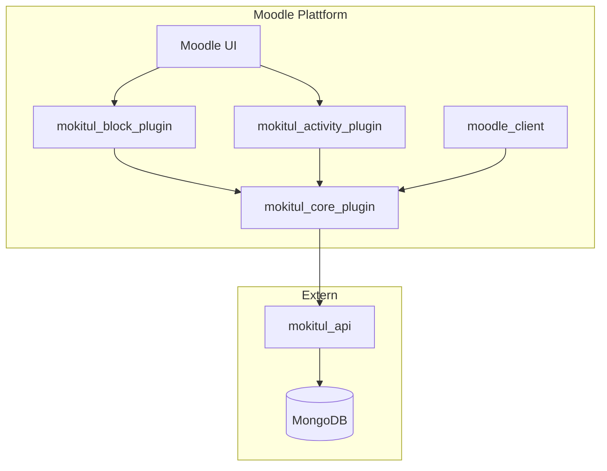

# MoKITUL
Meta Repository für die MoKITUL RAG Anwendung und Plugins für Moodle

## 📚 Inhaltsverzeichnis

- [🧪 Forschungsprojekt – Moodle Plugin-Suite & Python API](#-forschungsprojekt--moodle-plugin-suite--python-api)
- [🚀 Ziel & Hintergrund](#-ziel--hintergrund)
- [⚠️ Hinweis](#️-hinweis)
- [🫶 Mitwirken erwünscht!](#-mitwirken-erwünscht)
- [📺 Demonstration](#-demonstration)
- [🧑‍💻 Entwicklung](#-entwicklung)
- [🗺️ Roadmap](#️-roadmap)
- [📄 Lizenz](#-lizenz)
- [💌 Contact](#-contact)

## 🧪 Forschungsprojekt – Moodle Plugin-Suite & Python API

Dieses Repository bündelt eine Sammlung von Moodle-Plugins und eine begleitende Python-API, die im Rahmen eines Forschungsprojekts als Nebenprodukt entstanden sind. Die Software ist (noch) nicht für den Produktiveinsatz geeignet, sondern als Experimentiergrundlage und Beitrag zur Community gedacht.

Wir veröffentlichen den Quellcode Open Source, in der Hoffnung, dass er anderen hilft – sei es als Inspiration, Grundlage oder zum Weiterentwickeln.

Derzeit wird es intern an der Fachhochschule Erfurt getestet und von ausgewählten Studiengängen in Zusammenarbeit mit anderen Professoren getestet.

## 🚀 Ziel & Hintergrund

Die Plugin-Suite entstand im Rahmen eines Forschungsprojekts an der Fachhoschule Erfurt. Unsere Zielsetzung war vielseitig: Wir wollten interaktive Lehrformate erproben, eine lokale Datenverarbeitung durch selbstgehostete Komponenten ermöglichen, Lernanalytik unterstützen und den ständigen Plattformwechsel für Studierende im digitalen Lernalltag reduzieren.

Ursprünglich für den internen Gebrauch konzipiert, stellen wir den Code nun öffentlich zur Verfügung, um die Weiterentwicklung in der Community zu fördern und zu inspirieren.

## ⚠️ Hinweis

Dieses Projekt ist ein Nebenprodukt unserer Forschung und nicht für produktive Moodle-Installationen vorgesehen.
Der Code kann Bugs enthalten, die Sicherheitsprüfungen sind unvollständig. 
Die Nutzung erfolgt auf eigenes Risiko.

## 🫶 Mitwirken erwünscht!

Wir freuen uns über Feedback, Vorschläge oder Pull Requests! Wenn du Interesse an der Weiterentwicklung hast, melde dich gerne im Issue-Tracker oder per Mail.

## 📺 Demonstration


## 🧑‍💻 Entwicklung

### 🚧 lokale Entwicklungsumgebung einrichten:

Um lokal zu entwickeln sind folgende Dienste und Tools notwendig:

- [vollständiges Moodle Setup (Version 4 oder höher) inkl. Datenbank](https://github.com/bitnami/containers/blob/main/bitnami/moodle/docker-compose.yml)

- [MongoDb](https://www.mongodb.com)

- [Python 3.11+](https://www.python.org/downloads/)

- [Task](https://taskfile.dev) 

- [Node.js](https://nodejs.org/en)

- [Git](https://git-scm.com)

- [Git LFS](https://git-lfs.com)

Alternativ kann Docker genutzt werden um die Dienste und Datenbanken lokal zu nutzen.
Dev-Container können genutzt werden um Python & Node.js sowie Task nutzen zu können.

Ein Beispiel für eine Moodle Entwicklung Umgebung folgen bald.

### 📦 Komponenten

| Komponente             | Typ       | Repository-Link                                               |
|------------------------|-----------|---------------------------------------------------------------|
| mokitul_block_plugin   | Block     | [GitHub](https://github.com/MoKITUL-FH-Erfurt/...)            |
| mokitul_activity_plugin| Activity  | [GitHub](https://github.com/MoKITUL-FH-Erfurt/...)            |
| mokitul_core_plugin    | Core/Lib  | [GitHub](https://github.com/MoKITUL-FH-Erfurt/...)            |
| mokitul_api            | API       | [GitHub](https://github.com/MoKITUL-FH-Erfurt/...)            |
| moodle_client          | Frontend  | [GitHub](https://github.com/MoKITUL-FH-Erfurt/...)            |

- mokitul_block_plugin_moodle: Ein klassisches Block-Plugin, das auf Moodle-Dashboards oder Kursseiten eingebunden werden kann. Es dient primär als Einstiegspunkt zur Interaktion mit den Funktionen der anderen Komponenten.

- mokitul_activity_plugin_moodle: Eine benutzerdefinierte Aktivität, die direkt in Kursen eingebunden wird. Sie bietet eine Oberfläche für Studierende zur Durchführung von Aufgaben und sammelt dabei Daten für Analysezwecke.

- mokitul_core_plugin: Ein lokales Plugin, das Hilfsfunktionen, API-Zugänge und wiederverwendbare Logik zur Verfügung stellt. Es wird von Block- und Aktivitäts-Plugin gemeinsam genutzt.

- mokitul_api: Eine eigenständige Python-basierte REST-API, die als Brücke zwischen Moodle und externer Datenverarbeitung dient (z. B. Visualisierung, Lernanalytik).

- moodle_client: Eine React Anwendung welche durch das Core-Plugin injiziert wird.



### API-Dokumentation (in Arbeit 🚧)

### Roadmap & bekannte Baustellen (in Arbeit 🚧)

### 🛠️ Erste Schritte

Nachdem alle Tools installiert sind, können einzelne Komponenten geklont werden.

#### Beispiel Klonen eines Repositories:
```bash
git clone https://github.com/MoKITUL-FH-Erfurt/mokitul_block_plugin_moodle
```

```bash
cd mokitul_block_plugin_moodle
```

### 👨‍🔧 Entwicklung Plug-Ins

#### Beispiel um ein Plugin zu bauen
```bash
task
```

Jedes Plugin wird dann gebundelt und in einen ZIP-File verwandelt welcher auf Moodle hochgeladen werden kann.
Sowohl das Activity- als auch das Block-Plugin benötigen das Core-Plugin.

### 🌐 Entwicklung Moodle Client
Die Moodle-Client-Anwendung ist eine React-App, die durch das Activity- und Block-Plugin in Moodle integriert wird. Sie wird über das Core-Plugin bereitgestellt. Während der Entwicklung kann die App mithilfe eines Taskfiles direkt in einen Docker-Container übertragen werden, um die lokale Entwicklung und Tests zu erleichtern.

```bash
task
```

Weitere Dokumentation folgt.

## 🗺️ Roadmap

Aktuell wurde das Nutzer-Interface leicht angepasst und überarbeitet. Diese Änderungen befinden sich noch nicht in diesem Repository werden aber sobald wie möglich nachgepflegt.
Es gibt einige Ideen und Wünsche für Anpassungen. Diese werden als Issues und Tasks eingetragen sobald dies geklärt ist.

## 📄 Lizenz

Dieses Projekt steht unter der MIT-Lizenz.
Abhängigkeiten welche eine andere Lizenz nutzen werden in den jeweiligen Repositories in der Notice.md Datei beschrieben.

## 💌 Contact

[Die offizielle E-Mail des Projekts](mokitul@fh-erfurt.de)

[Die offizielle Homepage](https://ai.fh-erfurt.de/forschung-projekte/forschungsprojekte/mokitul)

## Trademarks and Disclaimer

Dieses Projekt ist weder mit Moodle noch mit MongoDB verbunden. 
Moodle und MongoDb sind eingetragene und geschützte Marken. Unser Projekt entwickelt und stellt lediglich Plugins zur Nutzung innerhalb von Moodle bereit.
