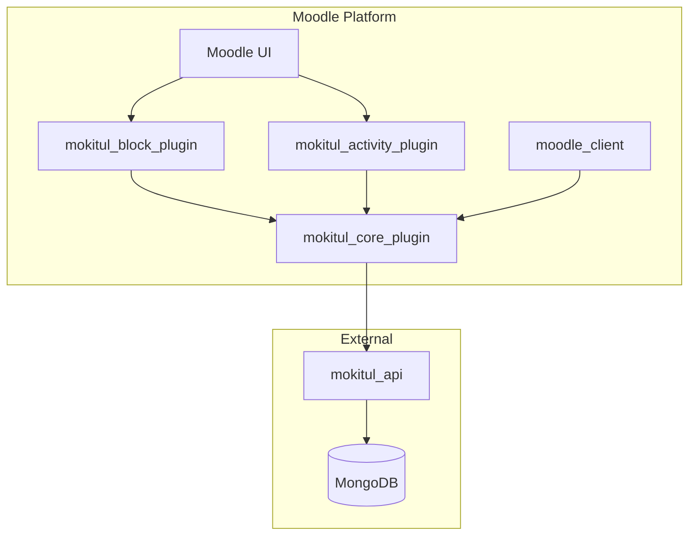

# MoKITUL
Meta repository for MoIRA (MoKITUL Integrated Retrieval Agent) for Moodle

## TLDR

In case you just want to know how to setup up MoIRA, refer to the [example setup](https://github.com/MoKITUL-FH-Erfurt/moira-example-setup).

## 📚 Table of Contents

- [🧪 Research Project – Moodle Plugin Suite & Python API](#-research-project--moodle-plugin-suite--python-api)
- [🚀 Goals & Background](#-goals--background)
- [⚠️ Disclaimer](#️-disclaimer)
- [🫶 Contributions Welcome!](#-contributions-welcome)
- [📺 Demonstration](#-demonstration)
- [⚙️ How to setup](#-how-to-setup)
- [🧑‍💻 Development](#-development)
- [📜 Roadmap](#-roadmap)
- [📄 License](#-license)
- [💌 Contact](#-contact)

## 🧪 Research Project – Moodle Plugin Suite & Python API

This repository bundles a collection of Moodle plugins and an accompanying Python API, developed as part of a research project. The software is (currently) not intended for production use, but rather as an experimental foundation and contribution to the community.

We are releasing the source code as open source, in the hope that it may help others – whether as inspiration, foundation, or for further development.

It is currently being tested internally at the University of Applied Sciences Erfurt and used in selected degree programmes in collaboration with other lecturers.

## 🚀 Goals & Background

This plugin suite was created as part of a research project at the University of Applied Sciences Erfurt. Our goals were multifaceted: we aimed to explore interactive teaching formats, enable local data processing through self-hosted components, support learning analytics, and reduce the need for constant platform switching in students' digital learning environments.

Originally designed for internal use, we are now making the code publicly available to foster further development within the community and inspire others.

## 🚧 Naming

We originally launched the project as MoKITUL. 
Problems arised as both the research project and this byproduct were hard to differentiate.
To get around this we renamed the application to MoIRA. 
Beware that some of the plugins might still be called Mokitul_Block_Plugin or similar. 
This will be changed in the future.

## ⚠️ Disclaimer

This project is a by-product of our research and is not intended for productive Moodle installations.
The code may contain bugs and has not undergone complete security audits.
Usage is at your own risk.

## 🫶 Contributions Welcome!

We welcome feedback, suggestions, or pull requests! If you are interested in contributing to the project, feel free to get in touch via the issue tracker or by email.

## 📺 Demonstration


## ⚙️ How to setup

A detailed guide on how to setup can be founde here: [example setup](https://github.com/MoKITUL-FH-Erfurt/moira-example-setup). 
This repository also contains a configuration suitable for develpoment and test purposes.

## 🧑‍💻 Development

### 🚧 Setting up a local development environment

To develop locally, the following services and tools are required:

- [Full Moodle setup (version 4 or higher) including database](https://github.com/bitnami/containers/blob/main/bitnami/moodle/docker-compose.yml)
- [MongoDb](https://www.mongodb.com)
- [Python 3.11+](https://www.python.org/downloads/)
- [Task](https://taskfile.dev)
- [Node.js](https://nodejs.org/en)
- [Git](https://git-scm.com)
- [Git LFS](https://git-lfs.com)

Alternatively, Docker can be used to run the services and databases locally.
Dev containers may be used for Python, Node.js and Task support.

An example Moodle development environment will be provided soon.

If you wish to use docker you can refer to the example setup provided in the [How to setup](#️-how-to-setup) section fo this readme.

### 📦 Components

| Component                | Type       | Repository Link                                             |
|--------------------------|------------|--------------------------------------------------------------|
| mokitul_block_plugin     | Block      | [GitHub](https://github.com/MoKITUL-FH-Erfurt/mokitul-block-plugin)           |
| mokitul_activity_plugin  | Activity   | [GitHub](https://github.com/MoKITUL-FH-Erfurt/mokitul-activity-plugin)           |
| mokitul_core_plugin      | Core/Lib   | [GitHub](https://github.com/MoKITUL-FH-Erfurt/mokitul-core-plugin)           |
| mokitul_api              | API        | [GitHub](https://github.com/MoKITUL-FH-Erfurt/mokitul-api)           |
| moodle_client            | Frontend   | [GitHub](https://github.com/MoKITUL-FH-Erfurt/mokitul-client)           |

- **mokitul_block_plugin_moodle**: A classic block plugin that can be embedded on Moodle dashboards or course pages. Primarily serves as an entry point to interact with other components.
- **mokitul_activity_plugin_moodle**: A custom activity that is embedded directly in courses. It provides an interface for students to complete tasks and collects data for analysis.
- **mokitul_core_plugin**: A local plugin providing helper functions, API access, and reusable logic. Shared by the block and activity plugins.
- **mokitul_api**: A standalone Python-based REST API serving as a bridge between Moodle and data processing (e.g. indexing, llm).
- **moodle_client**: A React application injected via the core plugin.



### API Documentation (in progress 🚧)

### Roadmap & Known Issues (in progress 🚧)

### 🛠️ Getting Started

Once all tools are installed, individual components can be cloned:

#### Example: Cloning a repository
```bash
git clone https://github.com/MoKITUL-FH-Erfurt/mokitul_block_plugin_moodle
cd mokitul_block_plugin_moodle
```

### 👨‍💼 Plugin Development

#### Example: Build a plugin
```bash
task
```

Each plugin will be bundled into a ZIP file that can be uploaded to Moodle.
Both the activity and block plugins require the core plugin.

### 🌐 Moodle Client Development

The Moodle client is a React application integrated into Moodle via the activity and block plugins. It is provided through the core plugin. During development, the app can be deployed directly into a Docker container using the Taskfile to simplify local testing and iteration.

```bash
task
```

Further documentation coming soon.

## 📜 Roadmap

The user interface has been slightly revised. These updates are not yet included in the repository but will be added as soon as possible.
There are also various ideas and feature requests, which will be tracked as issues and tasks once confirmed.

## 📄 License

This project is licensed under the MIT License.
Dependencies using different licenses are documented in the respective repositories in the `Notice.md` file.

## 💌 Contact

[Official project email](mailto:mokitul@fh-erfurt.de)

[Official project homepage](https://ai.fh-erfurt.de/forschung-projekte/forschungsprojekte/mokitul)

## Trademarks and Disclaimer

This project is not affiliated with Moodle or MongoDB.
Moodle and MongoDB are registered trademarks. Our project merely develops and provides plugins for use within Moodle.

